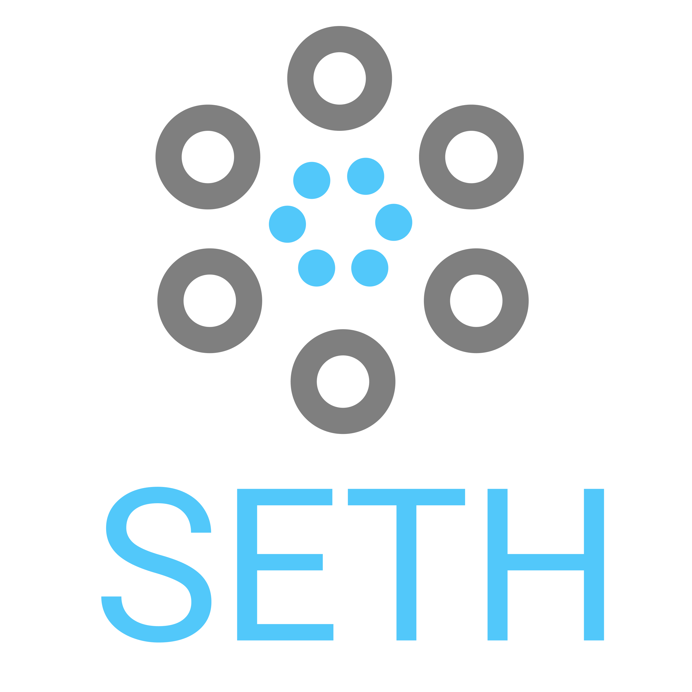

<!--
*** Thanks for checking out the Best-README-Template. If you have a suggestion
*** that would make this better, please fork the repo and create a pull request
*** or simply open an issue with the tag "enhancement".
*** Thanks again! Now go create something AMAZING! :D
-->


<!-- PROJECT SHIELDS -->
<!--
*** I'm using markdown "reference style" links for readability.
*** Reference links are enclosed in brackets [ ] instead of parentheses ( ).
*** See the bottom of this document for the declaration of the reference variables
*** for contributors-url, forks-url, etc. This is an optional, concise syntax you may use.
*** https://www.markdownguide.org/basic-syntax/#reference-style-links
-->


<!-- PROJECT LOGO -->
<br />
<p align="center">
  <a href="https://github.com/KevinAS28/SETH-DSC">
    
  </a>

  <h3 align="center">SETH</h3>

  <p align="center">
    Safe Electronic Ticket for Health
    <br />
    <br />
    <br />
    <a href="https://www.youtube.com/watch?v=nMipBSv4ch8">View Demo</a>
  </p>
</p>


<!-- TABLE OF CONTENTS -->
<details open="open">
  <summary>Table of Contents</summary>
  <ol>
    <li>
      <a href="#about-the-project">About The Project</a>
      <ul>
        <li><a href="#built-with">Built With</a></li>
      </ul>
    </li>
    <li>
      <a href="#getting-started">Getting Started</a>
      <ul>
        <li><a href="#prerequisites">Prerequisites</a></li>
        <li><a href="#installation">Installation</a></li>
        <li><a href="#configuration">Configuration</a></li>
      </ul>
    </li>
    <li><a href="#usage">Usage</a></li>
    <li><a href="#roadmap">Roadmap</a></li>
    <li><a href="#contributing">Contributing</a></li>
    <li><a href="#license">License</a></li>
    <li><a href="#contact">Contact</a></li>
    <li><a href="#acknowledgements">Acknowledgements</a></li>
  </ol>
</details>

<!-- ABOUT THE PROJECT -->
## About The Project

<!-- [![Product Name Screen Shot][product-screenshot]](https://example.com) -->

SETH - Solution Challenge 2021 - Gadjah Mada University - Google Developer Student Club

Components:
* [SETH Server](https://github.com/KevinAS28/SETH-Server)
* [SETH Mobile](https://github.com/delkirawan/SethCMobileApp)
* [Face Recognition Module](https://github.com/KevinAS28/Django-HTTP-Streaming-Face-Recognition) (Not officially part of SETH)

### Built With

* [Tensorflow](https://www.tensorflow.org/)
* [Flutter](https://flutter.dev/)
* [Google Cloud Platform](https://cloud.google.com/)
* [Python](https://www.python.org/)
* [Django](https://www.djangoproject.com/)
* [NodeMCUV3](https://www.nodemcu.com/index_en.html)

### Prerequisites

* UNIX based system (We haven't test it yet on Windows)
* Wifi network (Allow the port: 80, 81, 8080, 8000)
* Google Cloud Platform API Key: [https://console.cloud.google.com/apis/credentials](https://console.cloud.google.com/apis/credentials) (Make sure you have enabled the GMAPS API)
* (Optional for Fingerprint module): NodeMCU v3 & FPM10A Fingerprint shield

### Installation

1. Clone the repo [SETH](https://github.com/KevinAS28/SETH-DSC)
   ```sh
   git clone --recurse-submodules -j8 https://github.com/KevinAS28/SETH-DSC
   ```

2. Install the requirements
   ```sh
   cd SETH-DSC
   python -m pip install -r requrements2.txt #requirements1.txt is result of pip freeze
   ```

3. Follow the instruction to install (README.md) for each components: 
* [SETH Server](https://github.com/KevinAS28/SETH-Server)
* [SETH Mobile](https://github.com/delkirawan/SethCMobileApp)
* (Not officially part of SETH)[Face Recognition Module](https://github.com/KevinAS28/Django-HTTP-Streaming-Face-Recognition)


### Configuration

1. Connect all the devices (PC/Laptop/Phone/NodeMCU) to one network (WIFI)

2. Run the SETH-Server (on port 8000) and Face Recognition (on port 8080) Module in 1 device (Laptop/PC with webcam), please note this device IP. For the face recognition, please wait until both Face authentication and Face add module loaded


3. Change the IP configuration in SETH C Mobile app in lib/util/app_url.dart

4. (Optional) Change the IP configuration in Fingerprint module in SETH-Server/nodemcu_fingerprint.ino/nodemcu_fingerprint.ino

5. (Optional) If your webcam not detected, please take a look in 

    Django-HTTP-Streaming-Face-Recognition/face_core/add_face -> detect_camera() (for face registration)

    Django-HTTP-Streaming-Face-Recognition/face_core/auth_face -> detect_camera() (for face authentication)


## License

Distributed under the MIT License. See `LICENSE` for more information.


## Contact

Adella Irawan [https://www.linkedin.com/in/adellairawan/](https://www.linkedin.com/in/adellairawan/)

Alma Mahira Lazuardani [https://www.linkedin.com/in/alma-mahira-lazuardani/](https://www.linkedin.com/in/alma-mahira-lazuardani/)

Gerald Ivan Dharmawan [https://www.linkedin.com/in/gerald-ivan-dharmawan/](https://www.linkedin.com/in/gerald-ivan-dharmawan/)

Kevin A Sastramiharja [https://www.linkedin.com/in/kevinas28/](https://www.linkedin.com/in/kevinas28/)